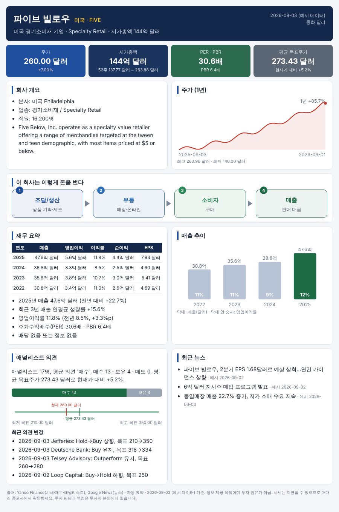

# stock-onepager · 원 페이지 종목 리포트

입력칸에 **종목명**을 넣으면 한 장짜리 종목 리포트를 만들어 주는 웹앱입니다.
대상 시장: 🇺🇸 미국 · 🇰🇷 한국 · 🇯🇵 일본 · 🇨🇳 중국 · 🇭🇰 홍콩



## 🎯 목표

| # | 리포트 구성 요소 | 상태 | 구현 |
|---|---|---|---|
| 1 | 한 줄 종목 설명 | ✅ | 헤더 아래 한 줄 (Claude 요약 또는 업종·시총 기반) |
| 2 | 회사 개요 | ✅ | 본사·업종·직원·주력 사업 bullet |
| 3 | 그림으로 회사가 하는 일 설명 | ✅ | "이 회사는 이렇게 돈을 번다" 4단계 흐름도 |
| 4 | 간략한 재무 분석 | ✅ | 최근 4년 매출·영업이익·순이익·EPS 표 + 매출 막대그래프 + 해석 |
| 5 | 최근 애널리스트 보고서 요약 | ✅ | 의견 분포, 목표주가 범위, 최근 의견 변경(상향/하향) |
| 6 | 최근 뉴스 | ✅ | 구글 뉴스(한국어, 최근 30일) + 야후 뉴스 |
| 7 | 작게 차트 그림 | ✅ | 1년 주가 차트 (상승 빨강/하락 파랑) |

### 다음 할 일
- [ ] 한국 종목 한글명 검색 확대 (KRX 전 종목 목록 내장)
- [ ] 중국 본토 종목 한글명 사전 확대
- [ ] PDF 저장 버튼
- [ ] 같은 업종 경쟁사 비교 표
- [ ] Streamlit Community Cloud 배포

## 사용법

```bash
pip install -r requirements.txt

# 웹 화면 (입력칸 → 리포트)
streamlit run app.py

# 명령줄로 HTML 파일 만들기
python -m onepager "삼성전자"          # → reports/삼성전자.html
python -m onepager 0700.HK -o tencent.html
python -m onepager --sample            # 네트워크 없이 예시 리포트
```

### 입력 예시

| 시장 | 이름으로 | 코드로 |
|---|---|---|
| 미국 | 애플, 엔비디아, 파이브빌로우 | `AAPL`, `FIVE`, `BRK.B` |
| 한국 | 삼성전자, SK하이닉스, 에코프로비엠 | `005930`, `247540.KQ` |
| 일본 | 토요타, 소니, 닌텐도 | `7203`, `7203.T` |
| 홍콩 | 텐센트, 샤오미, 팝마트 | `0700.HK`, `HK:700` |
| 중국 | 마오타이, CATL | `600519.SS`, `CN:600519`, `000858.SZ` |

- 6자리 숫자는 한국으로 처리 (코스피에 없으면 코스닥 자동 재시도). 중국 본토는 `CN:` 또는 `.SS/.SZ`를 붙이세요.
- 사전에 없는 이름은 야후 파이낸스 검색으로 찾습니다 (영어 이름이 더 잘 찾아짐).

### Claude 요약 (선택)
`ANTHROPIC_API_KEY` 환경변수를 설정하면 한 줄 설명·개요·사업 구조 그림·애널리스트 요약·뉴스 번역을
Claude가 한국어로 작성합니다. 없으면 규칙 기반 문장으로 만듭니다.
모델은 `ONEPAGER_MODEL`로 바꿀 수 있습니다 (기본 `claude-sonnet-5-5`).
Streamlit Cloud에서는 Secrets에 `ANTHROPIC_API_KEY = "..."`를 넣으세요.

## 구조

```
app.py                  Streamlit 웹 화면
onepager/
  resolver.py           종목명/코드 → 야후 심볼 (5개 시장, 별칭 사전 + 검색)
  data.py               시세·재무·애널리스트(yfinance) + 뉴스(구글 뉴스 RSS)
  narrative.py          한국어 문장 생성 (Claude API 또는 규칙 기반)
  render.py             한 장짜리 HTML (SVG 차트, 모바일·인쇄 대응)
  fmt.py                조·억 단위 숫자 표기
  sample.py             오프라인 예시 데이터
tests/                  네트워크 없이 도는 단위 테스트
```

테스트: `python -m unittest discover -s tests`

> 정보 제공 목적이며 투자 권유가 아닙니다. 데이터는 지연·누락될 수 있으니 매매 전 증권사에서 확인하세요.
